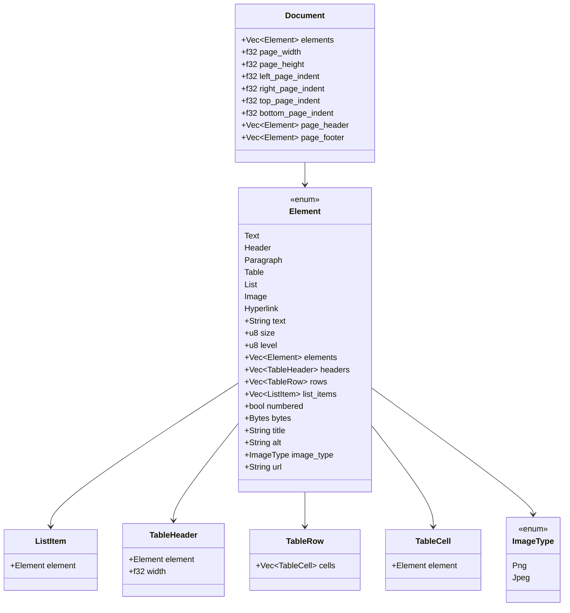

# Common Document Model

```mermaid
classDiagram
    class Document {
        +Vec~Element~ elements
        +f32 page_width
        +f32 page_height
        +f32 left_page_indent
        +f32 right_page_indent
        +f32 top_page_indent
        +f32 bottom_page_indent
        +Vec~Element~ page_header
        +Vec~Element~ page_footer
    }

    class Element {
        <<enum>>
        Text
        Header
        Paragraph
        Table
        List
        Image
        Hyperlink
    }

    Element : +String text
    Element : +u8 size
    Element : +u8 level
    Element : +Vec~Element~ elements
    Element : +Vec~TableHeader~ headers
    Element : +Vec~TableRow~ rows
    Element : +Vec~ListItem~ list_items
    Element : +bool numbered
    Element : +Bytes bytes
    Element : +String title
    Element : +String alt
    Element : +ImageType image_type
    Element : +String url

    class ListItem {
        +Element element
    }

    class TableHeader {
        +Element element
        +f32 width
    }

    class TableRow {
        +Vec~TableCell~ cells
    }

    class TableCell {
        +Element element
    }

    class ImageType {
        <<enum>>
        Png
        Jpeg
    }

    Document --> Element
    Element --> ListItem
    Element --> TableHeader
    Element --> TableRow
    Element --> TableCell
    Element --> ImageType

```