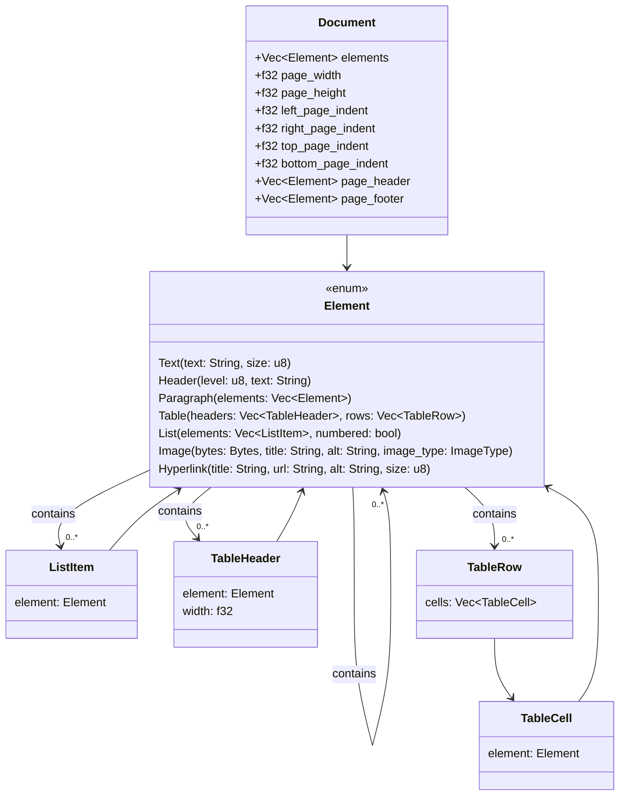

# Common Document Model

```mermaid
classDiagram
    class Document {
        +Vec~Element~ elements
        +f32 page_width
        +f32 page_height
        +f32 left_page_indent
        +f32 right_page_indent
        +f32 top_page_indent
        +f32 bottom_page_indent
        +Vec~Element~ page_header
        +Vec~Element~ page_footer
    }
    class Element {
      <<enum>>
      Text(text: String, size: u8)
      Header(level: u8, text: String)
      Paragraph(elements: Vec~Element~)
      Table(headers: Vec~TableHeader~, rows: Vec~TableRow~)
      List(elements: Vec~ListItem~, numbered: bool)
      Image(bytes: Bytes, title: String, alt: String, image_type: ImageType)
      Hyperlink(title: String, url: String, alt: String, size: u8)
    }
    
    class ListItem {
      element: Element
    }
    
    class TableHeader {
      element: Element
      width: f32
    }
    
    class TableRow {
      cells: Vec~TableCell~
    }
    
    class TableCell {
      element: Element
    }
    
    
    ListItem --> Element
    TableHeader --> Element
    TableRow --> TableCell
    TableCell --> Element
    Element --> "0..*" Element : contains
    Element --> "0..*" TableHeader : contains
    Element --> "0..*" TableRow : contains
    Element --> "0..*" ListItem : contains
    Document --> Element

```